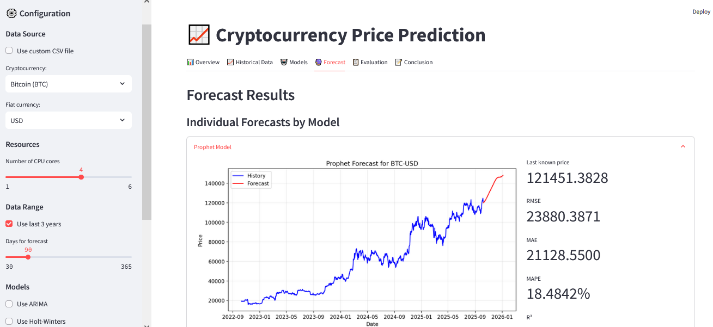

# 📈 Cryptocurrency Price Prediction Dashboard


An advanced and interactive **Streamlit-based dashboard** for forecasting cryptocurrency prices using a combination of **statistical**, **machine learning**, and **deep learning** models — including **ARIMA**, **Holt-Winters**, **Prophet**, **LSTM (PyTorch)**, **ETS**, and **Theta**.

This project is designed for **data scientists**, **students**, and **enthusiasts** who want to explore **time series forecasting**, **model comparison**, and **visual analysis** of cryptocurrency data.  


---

## 🧭 Overview

The **Cryptocurrency Price Prediction Dashboard** allows users to:

- Load cryptocurrency data from **Yahoo Finance** or upload a **custom CSV file**.  
- Analyze, visualize, and forecast price movements using multiple time series models.  
- Customize model configurations (e.g., hyperparameters, CPU usage).  
- Compare the accuracy of models with metrics such as **RMSE**, **MAE**, **MAPE**, and **R²**.  
- Display **technical indicators** like **SMA**, **EMA**, **RSI**, and **MACD**.  
- Forecast prices for up to **365 days** ahead.  

---

## 🚀 Key Features

| Feature | Description |
|----------|--------------|
| 📊 **Multi-Model Forecasting** | Compare ARIMA, Holt-Winters, Prophet, LSTM, ETS, Theta, and Linear Regression. |
| ⚡ **Real-Time Data** | Fetch live cryptocurrency data using Yahoo Finance. |
| 📂 **Custom Data Upload** | Import your own CSV datasets. |
| 🧮 **Statistical Metrics** | Evaluate models with RMSE, MAE, MAPE, and R². |
| 🔍 **Technical Indicators** | Include SMA, EMA, RSI, MACD for deeper trend analysis. |
| 🧠 **LSTM (PyTorch)** | Neural network-based forecasting for non-linear and long-term dependencies. |
| 🧰 **Resource Control** | Adjust CPU core usage for performance optimization. |
| 🎛️ **Interactive UI** | Full Streamlit interface with live charts and tab navigation. |

---

## ⚙️ Installation Guide

### 1️⃣ Clone the Repository
```bash
git clone https://github.com/Stojanovic94/Cryptocurrency-Price-Prediction.git
cd Cryptocurrency-Price-Prediction
```

### 2️⃣ Create a Virtual Environment (Recommended)

#### 🪟 On Windows:
```bash
python -m venv venv
venv\Scripts\activate
```

#### 🐧 On Linux / macOS:
```bash
python3 -m venv venv
source venv/bin/activate
```

### 3️⃣ Install Dependencies
If you have a `requirements.txt` file:
```bash
pip install -r requirements.txt
```

Or install manually:
```bash
pip install streamlit yfinance pandas numpy matplotlib autots prophet torch scikit-learn statsmodels psutil
```

### 4️⃣ Run the Streamlit App
```bash
streamlit run cryptocurrency_prediction_streamlit.py
```

Then open your browser at:
👉 [http://localhost:8501](http://localhost:8501)

---

## 🧩 Data Input Options

### 📡 Option 1: Fetch Live Data
Select a cryptocurrency and fiat currency (e.g., BTC/USD, ETH/EUR) directly from the sidebar.

### 📁 Option 2: Upload Custom CSV
Upload a `.csv` file in the following format:

| Datum | Cena |
|--------|------|
| 2020-01-01 | 7000.25 |
| 2020-01-02 | 7100.50 |
| ... | ... |

> ⚠️ Columns must be named **`Date`** and **`Price`**.

---

## 🧠 Models Included

| Model | Type | Description |
|--------|------|-------------|
| **ARIMA** | Statistical | Great for stationary and short-term series. |
| **Holt-Winters** | Statistical | Smooths data with trend and seasonality. |
| **Prophet** | Machine Learning | Developed by Meta, handles missing data and seasonality well. |
| **LSTM (PyTorch)** | Deep Learning | Learns complex and nonlinear patterns over time. |
| **ETS** | Statistical | Decomposes data into error, trend, and seasonality components. |
| **Theta** | Statistical | Efficient general-purpose forecasting method. |
| **Linear Regression** | Machine Learning | Captures linear growth or decline trends. |

---

## 📊 Evaluation Metrics

| Metric | Meaning |
|---------|----------|
| **RMSE** | Root Mean Square Error — lower values are better. |
| **MAE** | Mean Absolute Error — measures average absolute deviation. |
| **MAPE** | Mean Absolute Percentage Error — accuracy in percentage form. |
| **R²** | Coefficient of Determination — measures goodness of fit (closer to 1 is better). |

---

## 🧠 Example Workflow

1. Launch the Streamlit dashboard.  
2. Choose your data source (live data or custom CSV).  
3. Select models and forecast duration.  
4. Optionally configure LSTM hyperparameters:
   - Sequence length
   - Hidden size
   - Layers
   - Epochs
   - Learning rate
   - Batch size
5. Run the analysis.  
6. Review results across six tabs:
   - **Overview** — configuration summary.  
   - **Historical Data** — charts and statistics.  
   - **Models** — configuration and details.  
   - **Forecast** — visual forecasts by model.  
   - **Evaluation** — model comparison metrics.  
   - **Conclusion** — model interpretation and recommendations.  

---

## 📈 Example Output

- 📉 Interactive price charts  
- 📊 Model comparison tables  
- 🧩 Combined multi-model forecasts  
- 📋 Metric-based evaluation (RMSE, MAE, MAPE, R²)  
- 🧠 LSTM-specific insights (training epochs, layers, hidden size)

---

## 🧭 Future Enhancements

- 🧠 Integrate **sentiment analysis** using Twitter and Reddit data.  
- 🌍 Include **macroeconomic and blockchain metrics** (e.g., inflation, market cap).  
- ⚙️ Implement **ensemble model aggregation** for improved accuracy.  
- 📊 Add **hyperparameter optimization** and model tuning features.  
- 🪄 Export results as PDF or Excel reports.  

---

## ⚠️ Disclaimer

> **Disclaimer:**  
> This project is created for **educational and research purposes only**.  
> It is **not intended as financial advice**.  
> Always do your own research and consult financial experts before making investment decisions.

---
